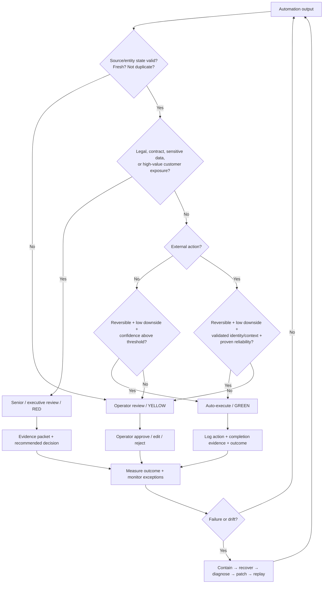

# Risk Decision Tree

## Principle
Automation earns autonomy through measured reliability and bounded downside. The policy should reduce review as evidence improves, while immediately tightening controls after a material failure.
